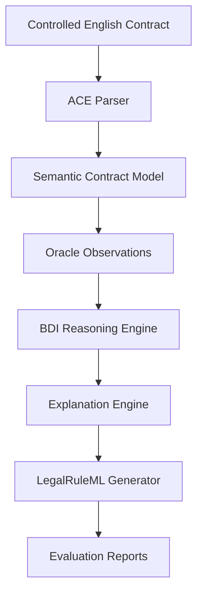

# SEASC Reasoning Proof-of-Concept

## Human-Manageable and Explainable Self-Aware Smart Contracts

This repository contains the **proof-of-concept implementation** accompanying the research paper:

> **Human-Manageable and Explainable Self-Aware Smart Contracts through Semantic Preservation, BDI Reasoning, and Formal Verification**

The prototype operationalizes the reasoning framework proposed for **Research Question 2 (RQ2)** by transforming controlled-English contractual specifications into executable semantic models, explainable BDI reasoning, LegalRuleML representations, and reproducible evaluation artifacts.

Unlike conventional smart-contract implementations, the focus of this prototype is **semantic transparency**, **explainable execution**, and **research reproducibility** rather than production blockchain deployment.

---

# Research Objective

This repository operationalizes the artifact proposed for **Research Question 2 (RQ2)**:

> **What reasoning structures let a smart contract behave interpretably and justify its decisions during execution?**

The prototype demonstrates that Belief–Desire–Intention (BDI) reasoning can provide transparent and explainable contractual execution while preserving contractual semantics throughout the reasoning process.

---

# Prototype Workflow



The implementation follows the reasoning pipeline presented in the accompanying paper:

1. Parse a controlled-English contractual specification.
2. Construct an executable semantic contract model.
3. Incorporate oracle observations.
4. Perform explainable BDI reasoning.
5. Generate human-readable explanations.
6. Produce LegalRuleML representations.
7. Generate reproducible evaluation artifacts.

---

# Repository Structure

```
contracts/
input/
model/
parser/
reasoning/
translator/
generated/
evaluation/
scripts/

main.py
README.md
requirements.txt
```

---

# Mapping to the Paper

| Repository Component | Paper Artifact |
|----------------------|----------------|
| ACE Parser | Controlled-English semantic translation |
| Semantic Contract Model | Executable semantic representation |
| Oracle Observations | Oracle-aware reasoning |
| BDI Reasoning Engine | Explainable execution model |
| Explanation Engine | Human-manageable reasoning |
| LegalRuleML Generator | Semantic preservation artifact |
| Experiment Runner | Prototype evaluation |
| Generated Reports | Reproducibility evidence |

---

# Installation

Clone the repository:

```bash
git clone https://github.com/PHD-SelfAware-SmartContracts/seasc-reasoning-poc.git

cd seasc-reasoning-poc
```

(Optional) Create a virtual environment:

```bash
python3 -m venv .venv

source .venv/bin/activate
```

Install dependencies:

```bash
pip install -r requirements.txt
```

---

# Running the Prototype

Execute the reasoning pipeline:

```bash
python3 main.py
```

Example output:

```text
============================================================
SEASC RQ2 Proof-of-Concept
============================================================

Contract Summary
------------------------------
Participants : 5
Rules        : 5
Observations : 3

Reasoning Summary
------------------------------
Beliefs      : 3
Goals        : 3
Intentions   : 3
Decision     : Arbitration

Pipeline completed successfully.
```

---

# Running the Evaluation

Execute the experimental evaluation:

```bash
python3 -m scripts.run_experiments
```

This automatically reproduces the evaluation reported in the paper and generates:

```
evaluation/

results.csv
results_table.tex
```

---

---

# Formal Verification

The repository includes a reproducible formal verification artifact developed in **TLA+** and verified using the **TLC Model Checker**.

The verification artifact complements the reasoning prototype by establishing correctness properties of the executable contract model beyond functional execution.

The verified properties include:

- Contract state consistency
- Oracle observation correctness
- Belief–Desire–Intention (BDI) state consistency
- Payment authorization safety
- Weak fairness assumptions
- Eventual contract resolution (liveness)

The verification package is located in:

```text
verification/

README.md
properties.md

tla/
    InsuranceContract.tla
    InsuranceContract.cfg
    modules/

tlc/
    invariant_report.txt
    reachable_states.txt
    statistics.txt

traces/
```

The verification directory contains:

- executable TLA+ specifications;
- TLC model-checking configuration;
- verified safety and liveness properties;
- representative execution traces; and
- verification reports supporting reproducibility.

See `verification/README.md` for instructions on reproducing the verification results.

# Generated Artifacts

Running the prototype and verification produces the following research artifacts:

```text
generated/
    legalruleml/
    reports/

evaluation/
    results.csv
    results_table.tex

verification/
    tla/
    tlc/
    traces/
```

Together, these artifacts provide reproducible evidence supporting both the operational evaluation and the formal verification presented in the accompanying paper.
# Reproducibility

The repository is designed as a **research artifact**.

Starting from a clean clone, the following commands reproduce the complete reasoning pipeline and evaluation:

```bash
python3 main.py

python3 -m scripts.run_experiments
```

No manual modification of generated artifacts is required.

---

# Scope

This implementation is a **proof-of-concept prototype** intended to validate the reasoning framework proposed in the paper.

It demonstrates:

- semantic translation from controlled English;
- executable semantic contract models;
- explainable BDI reasoning;
- LegalRuleML generation;
- reproducible experimental evaluation.

It is **not** intended to be a production blockchain deployment or a complete smart-contract platform.

---

# Relation to the Paper

The repository provides executable evidence supporting the claims made in the accompanying paper, including:

- semantic preservation across reasoning stages;
- explainable contractual execution;
- automatic generation of LegalRuleML artifacts;
- reproducible experimental evaluation.

The prototype complements the formal development presented in the paper and demonstrates the operational feasibility of the proposed reasoning pipeline.

---

# Citation

If you use this repository in academic work, please cite the accompanying conference paper.

A BibTeX entry will be added after publication.

---

# License

This project is released under the **MIT License**.
